# JavaScript Front-End Trio

  <h3>React Page</h3>
  
  

    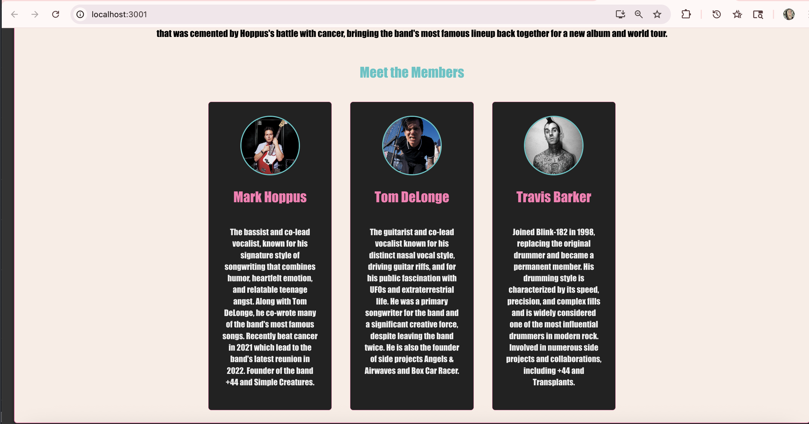
    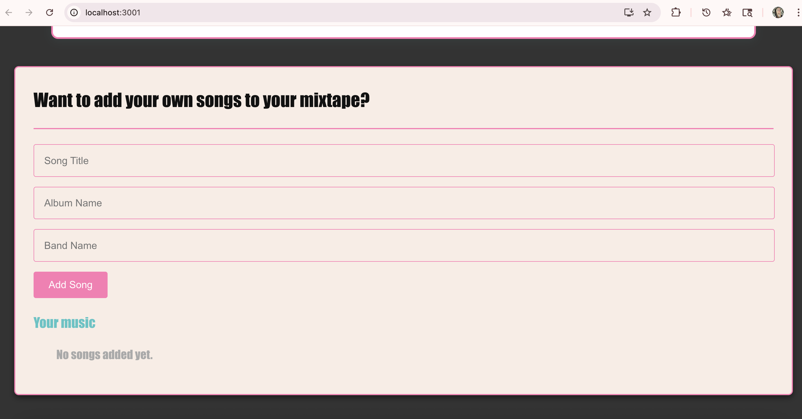
  

  

    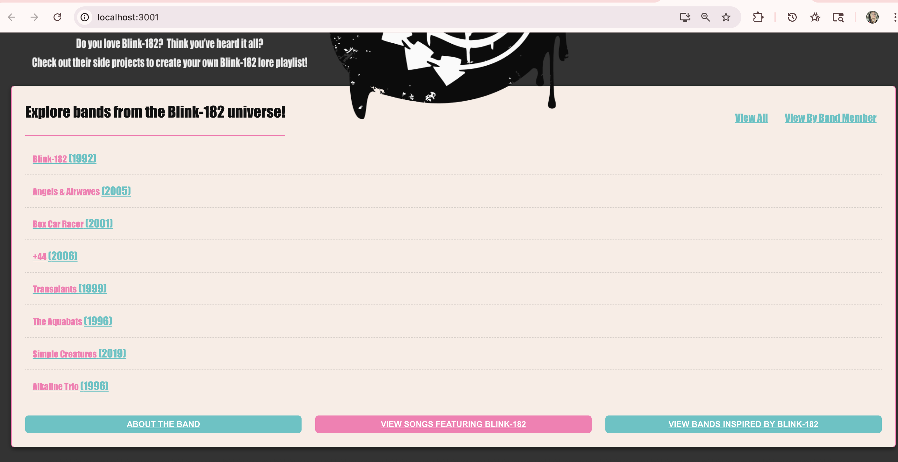
    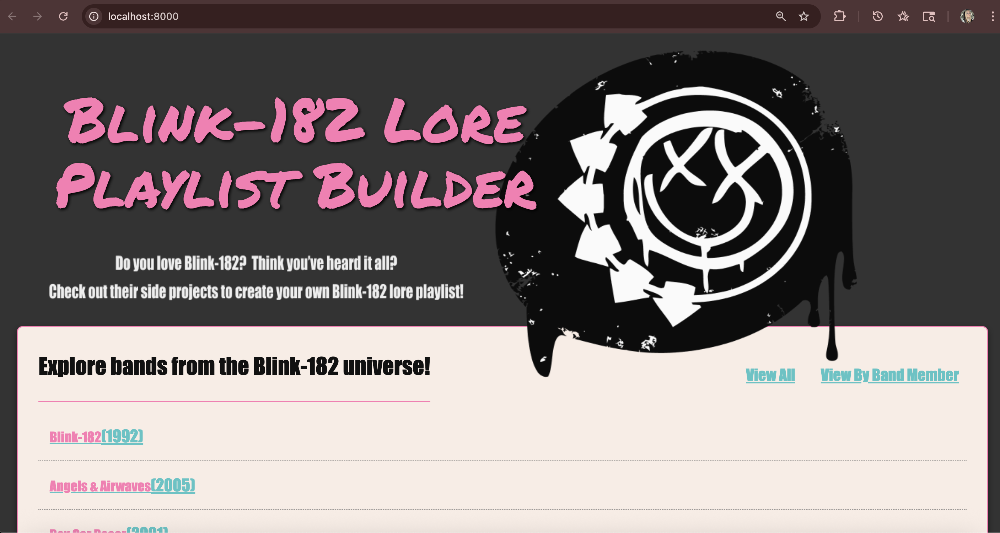
    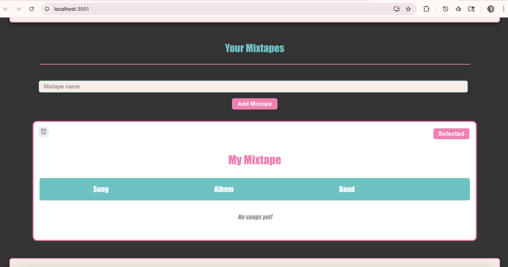
  

  

    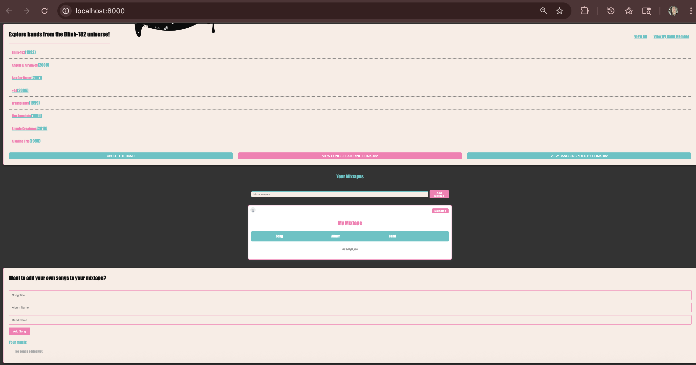
    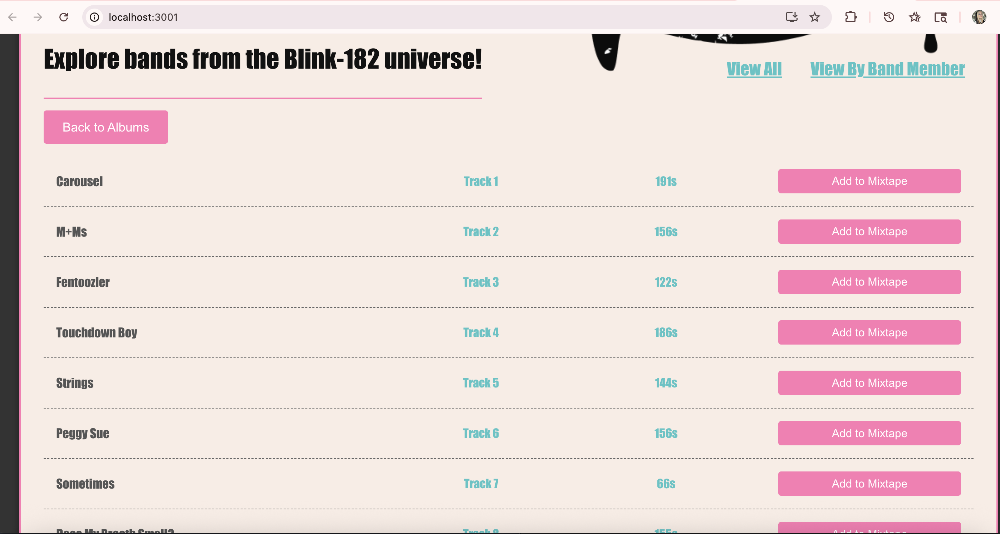
  

  <h3>Vue.js</h3>
  
  

    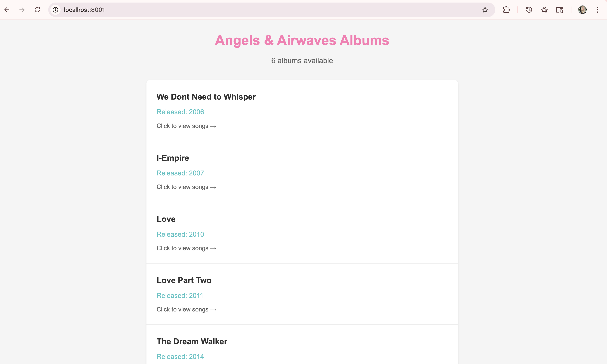
    
  

  <h3>Vanilla JS</h3>
  
  

    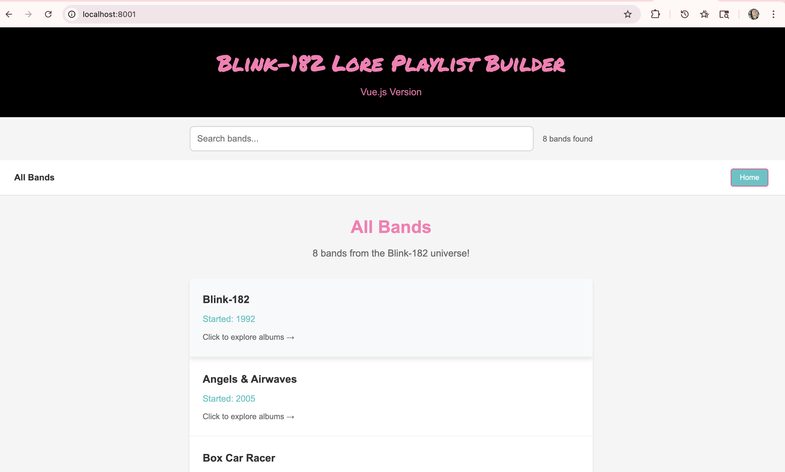
    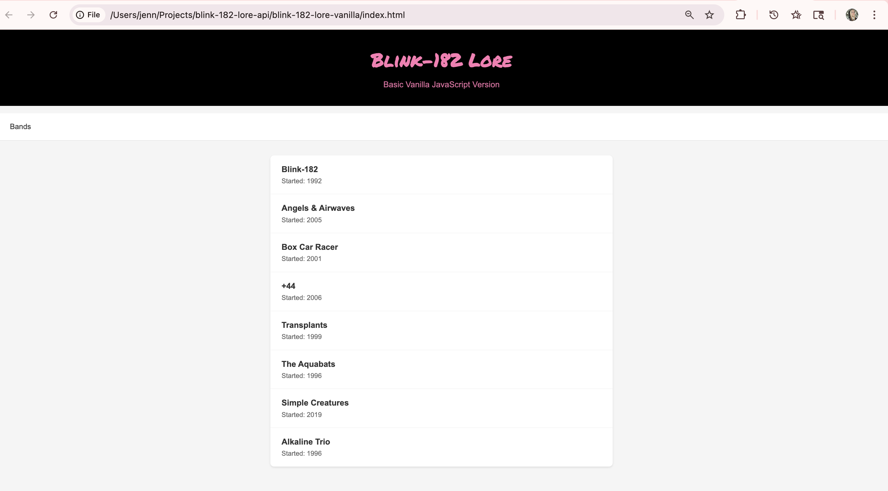
  

  

    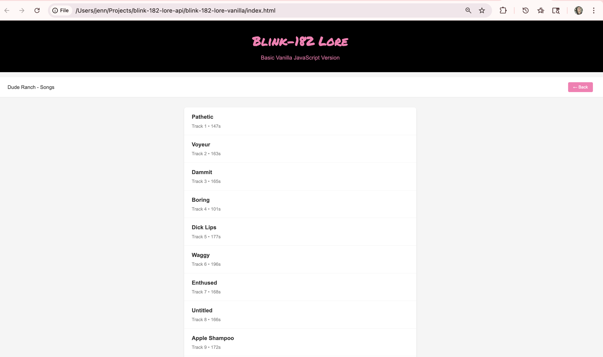
  

