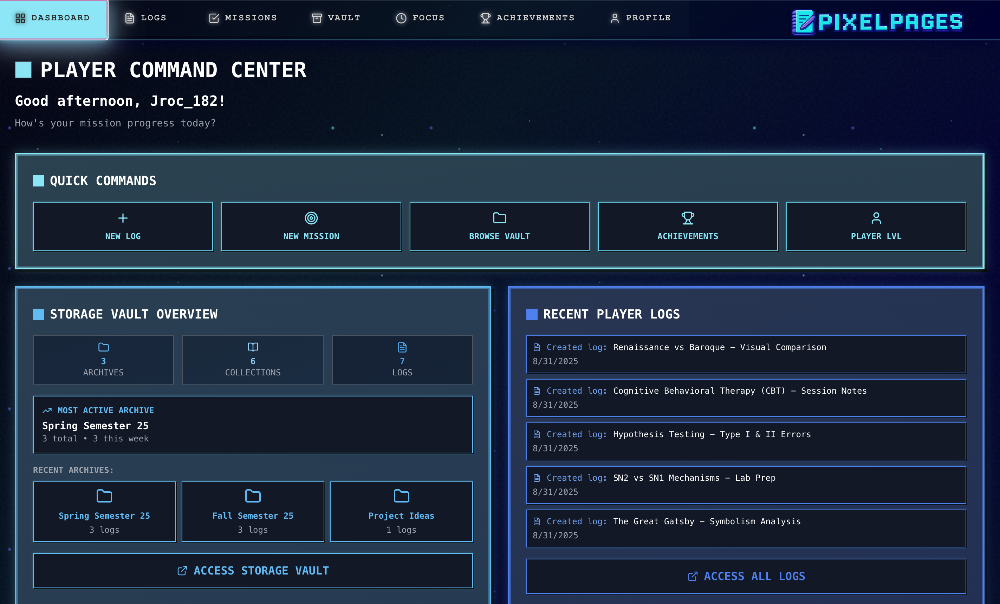
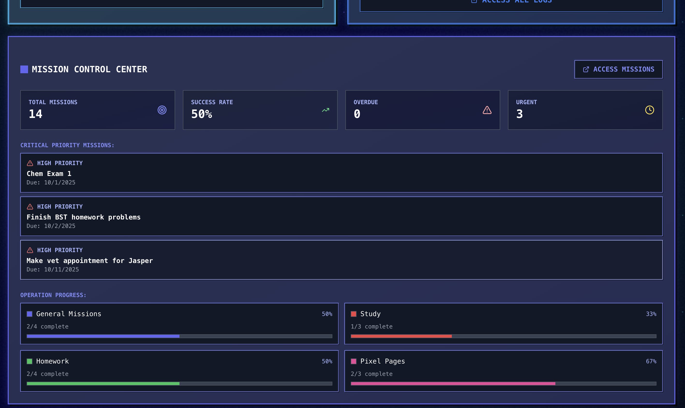
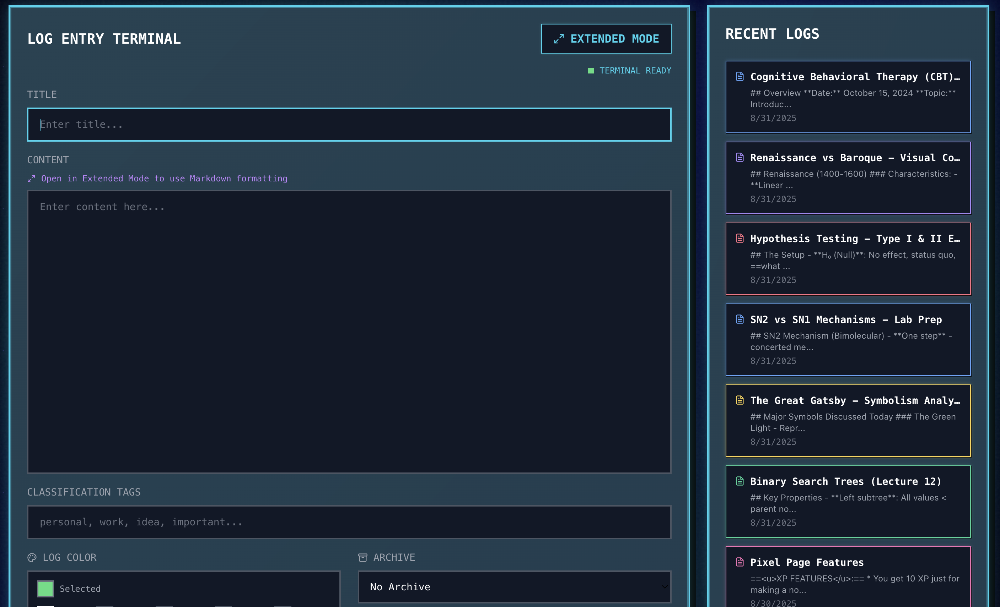
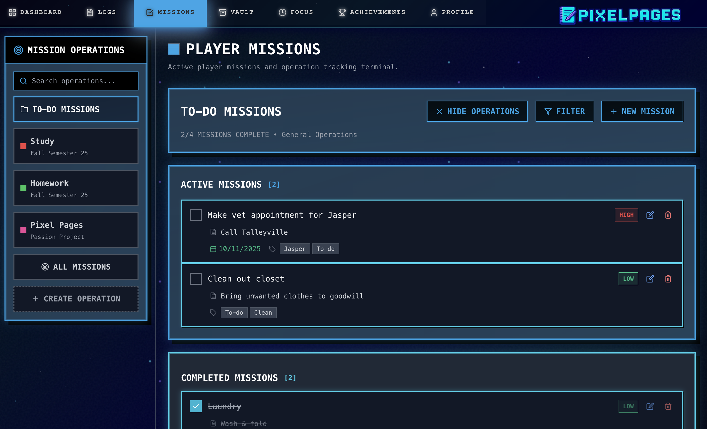
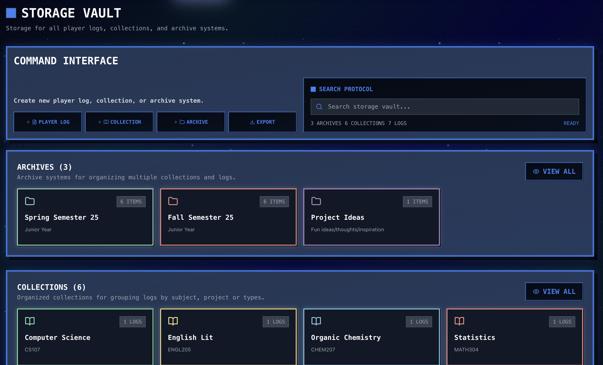
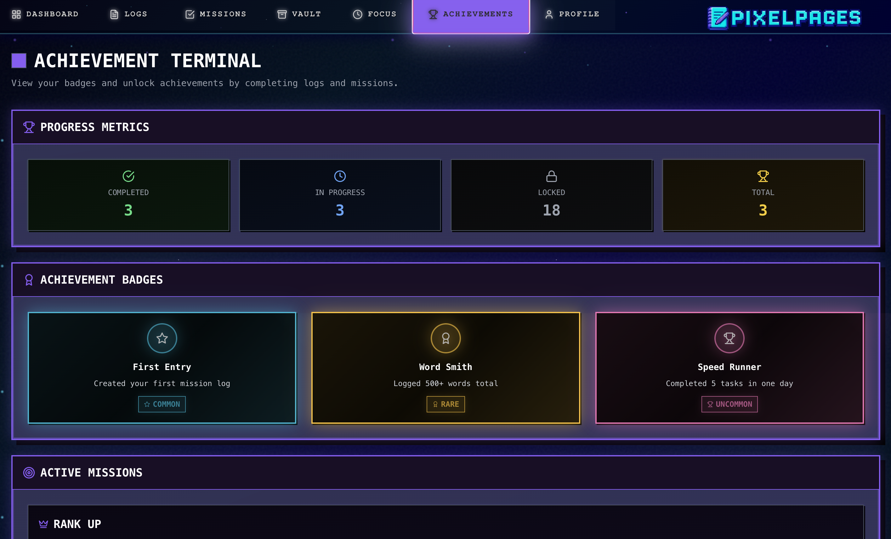
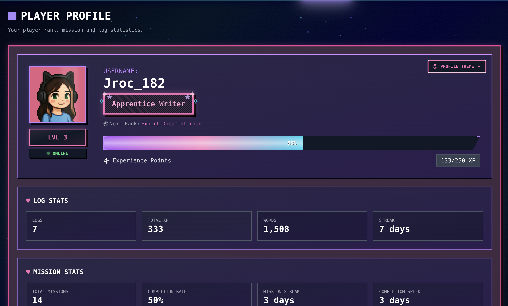
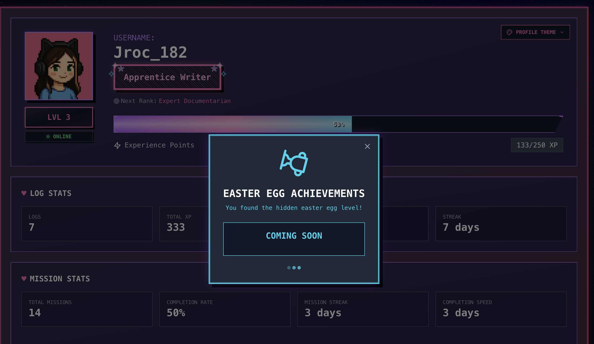

# Pixel Pages
  

    <h3>(Still a work in progress!)</h3>
    
The code still needs to be cleaned up and some achievement/stat logic/new features implemented but here are some screenshots of the current state of the app!

  

    <h3>Main Dashboard</h3>
    
  

  

    <h3>Mission Control Dashboard</h3>
    
  

    

    <h3>Log Entry System</h3>
    
  

    

    <h3>Player Missions Dashboard</h3>
    
  

  

    <h3>Storage Vault Interface</h3>
    
  

    <h3>Achievements Page</h3>
    
  

  

    <h3>Player Profile Page</h3>
    
  

    

    <h3>Easter Egg</h3>
    
  

      <h4>Repo Link:</h4>
      
 https://github.com/jenn-182/Pixel-Pages.git

